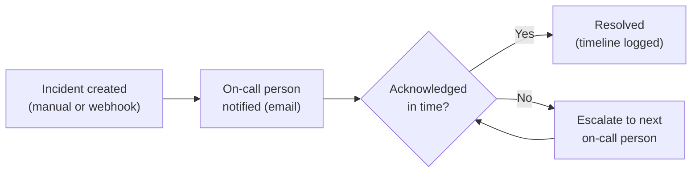
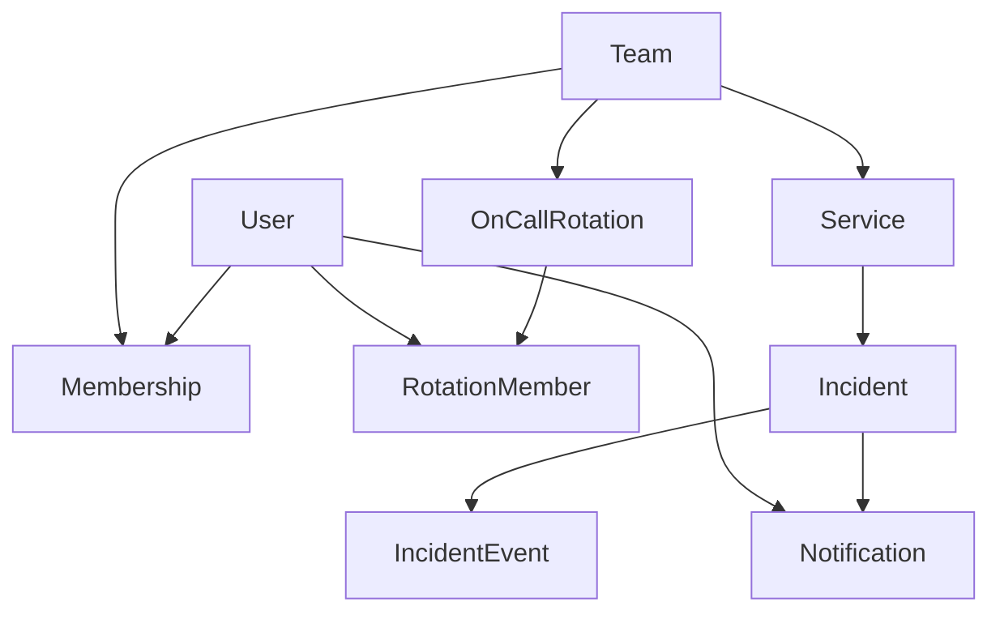

# 🚨 PagerDuty Lite (working title)

_Trigger → notify → acknowledge/escalate → resolve._

**Status:** Design locked · **Backend walking skeleton built & verified** (Slice 1) · frontend next

A lightweight incident and on-call tracker, inspired by PagerDuty.
Full-stack learning project and resume piece — scoped, planned, and built
independently, not generated wholesale.

**Design docs:** [`docs/`](./docs/README.md) — [user-stories](./docs/user-stories.md) ·
[state-machine](./docs/incident-state-machine.md) · [data-model](./docs/data-model.md) ·
[api-contract](./docs/api-contract.md) · [escalation-flow](./docs/escalation-flow.md) ·
[architecture](./docs/architecture.md) · [**decisions**](./docs/decisions.md) (every decision + why).
Progress: [`PROGRESS.md`](./PROGRESS.md).

---

## 📑 Contents

- [What this is](#-what-this-is)
- [Who it's for](#-who-its-for)
- [Tech stack](#-tech-stack)
- [Run it yourself](#-run-it-yourself)
- [Core loop (v1, must work end-to-end)](#-core-loop-v1-must-work-end-to-end)
- [Walking skeleton (first build milestone)](#-walking-skeleton-first-build-milestone)
- [Domain nouns, relationships & build order](#-domain-nouns-relationships--build-order)
- [Supporting features](#-supporting-features)
- [Explicitly out of scope for v1](#-explicitly-out-of-scope-for-v1)
- [Success metrics (v1)](#-success-metrics-v1)
- [Later (v2+) — the flagship layer](#-later-v2--the-flagship-layer)
- [Status](#-status)

---

## 📖 What this is

A "service" (an app, an API, whatever) can have something go wrong.
Someone is on-call for that service. They get notified, they acknowledge
or resolve it, and if they don't respond in time, it escalates to the
next person. That loop is the whole product.

It is deliberately **not** an exercise in distributed systems — no
message queues, no microservices, no multi-region anything. One backend,
one database, one frontend, done well.

---

## 🎯 Who it's for

Me, first — this is a portfolio project, not a product with real users.
Built as if a small team (5–10 people) would actually use it to track
who's on-call and what's currently broken.

---

## 🧰 Tech stack

Decided on purpose, not inherited by default — the backend already
existed as a scaffold before this README was rewritten, and it was kept
because it's genuinely the right fit, not out of inertia.

| Layer | Choice |
|---|---|
| Backend | NestJS + TypeScript |
| ORM | Prisma |
| Database | PostgreSQL |
| Real-time | WebSockets (NestJS's native gateway support) — later slice |
| Email | nodemailer + Ethereal (dev); a real provider later |
| Frontend | React + Vite (SPA, no SSR) — later slice |
| Deployment | Railway (target) |

> **This is a backend-first project.** It runs locally and is exercised via
> `curl` + an automated test — there are no real users, no login yet, and no
> UI in the current slice. The frontend is a later slice.

---

## 🏃 Run it yourself

Everything runs locally. **Prereqs:** Node ≥ 18, PostgreSQL 17 (Homebrew:
`brew install postgresql@17`), macOS/Linux.

```bash
# 1. Start Postgres and create the dev database
brew services start postgresql@17
createdb pagerduty_dev            # first time only (ignore "already exists")

# 2. Backend setup (from the repo root)
cd server
npm install
cp .env.example .env              # then set USER in DATABASE_URL to your Postgres role
npx prisma migrate dev            # create tables from the schema
npx prisma db seed                # 1 team, 1 service, Alice + Bob on-call
                                  # ← prints the serviceId + integrationKey

# 3. Prove the tricky part works (escalation timing)
npm test                          # escalation spec goes green

# 4. Run the API
npm run start                     # http://localhost:3000
```

**Exercise the core loop** (use the `serviceId` the seed printed):

```bash
# create an incident → assigned to Alice, first email sent (Ethereal preview URL in the server log)
curl -XPOST localhost:3000/services/<serviceId>/incidents \
  -H 'Content-Type: application/json' \
  -d '{"title":"API 500s spiking","severity":"P1"}'

# view it + its timeline (grab the "id" from the create response)
curl localhost:3000/incidents/<id>

# if nobody acks within the team's timeout, the 30s scheduler escalates Alice → Bob.
# acknowledge / resolve (userId from the seed output; no auth yet):
curl -XPOST localhost:3000/incidents/<id>/ack     -H 'Content-Type: application/json' -d '{"userId":"<bobId>"}'
curl -XPOST localhost:3000/incidents/<id>/resolve -H 'Content-Type: application/json' -d '{"userId":"<bobId>"}'
```

The final timeline reads `TRIGGERED → NOTIFIED → ESCALATED → ACKNOWLEDGED → RESOLVED`.
Emails aren't really delivered — the server log prints an **Ethereal preview URL**
you can open to see each one.

**New to the code?** Read `docs/plan.md` (where the project is), then
`docs/decisions.md` (why), then `server/src/incidents/incidents.service.ts`
(the heart — the whole state machine).

---

## 🔁 Core loop (v1, must work end-to-end)



1. An incident is created for a service — manually via the UI, or by
   hitting a webhook endpoint (simulating a monitoring tool firing an
   alert)
2. The on-call person for that service is notified (email)
3. They acknowledge it (stops escalation), or if they don't respond
   within a set time, it escalates to the next person on the rotation
4. Incident gets resolved; the full timeline (created, acked, escalated,
   resolved, by whom, when) is visible after the fact

---

## 🦴 Walking skeleton (first build milestone)

Not the same thing as v1. The walking skeleton is the thinnest possible
slice that exercises every layer of the architecture — frontend, backend,
database, one real external effect — end to end. Its only job is to
prove the wiring works. Everything else in v1 gets layered on top of it
once it's running.

Tested against "if I remove this, does the core loop break?": auth,
services, severity, and live updates all survive removal — the loop
still runs without them. Only *some way to know who's on-call* is
load-bearing, and that can be hardcoded for now.

- 2 seeded users, no real signup/login yet (real auth comes right after)
- 1 incident, no severity, no service registry
- Create incident → real email sent to the seeded on-call user
- Unacknowledged in time → escalates to the second seeded user (proves
  the timer + state-transition layer actually works, not just the CRUD)
- Bare, unstyled page: list incidents, one button to acknowledge/resolve
  — manual refresh is fine here, no WebSocket yet
- Full timeline visible for that one incident

Once this works end-to-end, the rest of v1 fills in around it: real
auth, teams, services, real rotation, severity, dashboard polish, live
updates.

---

## 🗺️ Domain nouns, relationships & build order

Conceptual pass before the full ER-level data model — the nouns, how
they relate, and the order they need to be built in.



Build order — each step depends only on what's above it:

1. **User**
2. **Team**, **Membership** (user ↔ team, carries role)
3. **Service**, **OnCallRotation** + **RotationMember** (both depend on Team)
4. **Incident** (depends on Service, and on resolving who's on-call)
5. **IncidentEvent** (timeline), **Notification** (both depend on Incident)

---

## 🧩 Supporting features

- Auth: signup/login, basic roles (admin / responder / viewer)
- Teams, with a single on-call rotation per team (no layered/overlapping
  schedules — one rotation, one active person at a time)
- Services, each belonging to a team
- Severity levels on incidents (P1/P2/P3)
- Dashboard: active incidents, current on-call per team
- Live-updating incident list in the UI (no manual refresh)

---

## 🚫 Explicitly out of scope for v1

- SMS/phone/Slack notifications
- Multiple or overlapping schedules
- Timezone-aware scheduling
- Status pages
- Analytics/reporting
- Multi-tenant billing
- Mobile app

If scope starts drifting toward any of these, that's a sign to cut, not
extend.

---

## ✅ Success metrics (v1)

- [ ] Core loop runs end-to-end on a real deployed instance — not just
      localhost
- [ ] Escalation timing is covered by an actual test, not eyeballed once
      and trusted
- [ ] The whole loop can be demoed live, start to finish, with no manual
      DB edits or restarts
- [ ] Every entity and every decision in this README can be explained
      out loud, unprompted
- [ ] Nothing exists in the running app that isn't listed in this
      README's v1 scope

---

## 🏆 Later (v2+) — the flagship layer

Not part of v1. The goal here is **not** more features — it's making v1
feel like real software instead of a tutorial project. Most of what makes
a full-stack project actually impressive is execution quality, not scope.

### 🛠️ Engineering bar (this is most of what "flagship" means)

- Test coverage on the logic that's actually tricky — escalation timing,
  on-call rotation edges, timezone handling — not just happy-path CRUD
- CI pipeline: lint + test + build on every push
- Real deployment: live URL, real Postgres, environment config done
  properly — not just running on localhost
- API done right: consistent validation and error responses, pagination
  on list endpoints — not just "works once in Postman"
- Frontend polish: loading/error/empty states handled everywhere, not
  just the happy path

### ✨ Feature additions (kept deliberately small)

- Automated health-check polling — services get polled, incidents
  auto-create on failure. The one genuinely new capability here: it turns
  this from a manual incident tool into a monitoring platform
- Timezone-aware on-call scheduling with manual overrides — this is the
  "hard to get right" business logic that actually separates working
  software from a tutorial project
- Analytics (MTTR, uptime %) — only worth building once there's real
  incident history behind it; otherwise it's a chart over fake data

### ❌ Cut / decided against (not planned, not deferred — just no)

| Item | Decision |
|---|---|
| Multi-channel notifications (Slack/Discord/SMS) | Cut — once email works, another channel is just a different API call, not a new skill |
| Structured inbound webhook parsing (Prometheus/Grafana payloads) | Cut — redundant with the generic webhook already in v1 |
| Job queue + retry/backoff (BullMQ + Redis) | Decided against — staying queue-free, retries happen in-process |
| Docker Compose | Downgraded — optional polish; a live deployment matters more on a resume than local containerization |

---

## 📌 Status

Idea, scope, and tech stack are locked. Data model, ER, and API design are
being worked out independently, not generated wholesale — this README
will grow deliberately as those decisions get made.

Prior planning docs from an earlier (AI-driven) pass exist in `Olddocs/`
for reference only. They are not the plan.
