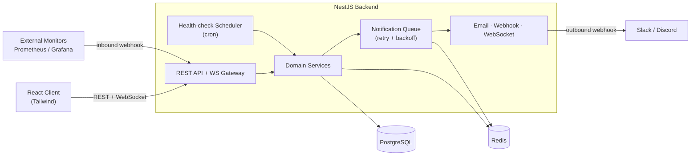
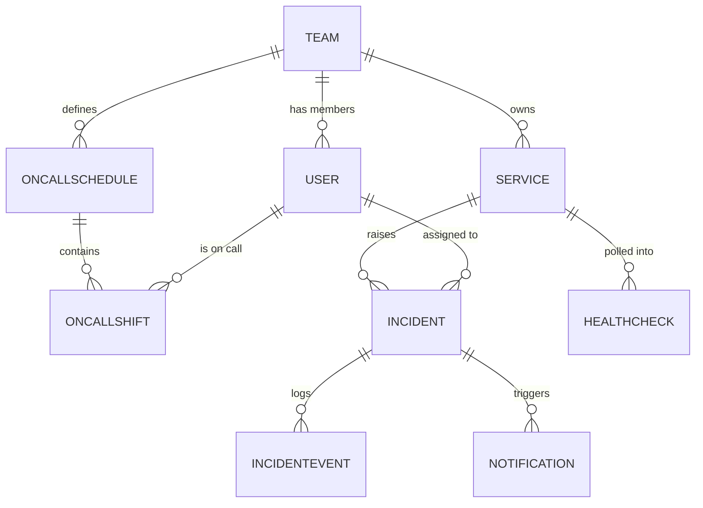

<h1 align="center">🚨 PagerDuty‑Lite</h1>
<p align="center">
  <strong>A developer incident‑management platform</strong><br/>
  Real‑time alerting · on‑call scheduling · automated health‑checks · webhook ingestion · resilient notifications
</p>

<p align="center">
  
  
  
  
</p>

---

## 📑 Table of Contents

1. [Overview](#-overview)
2. [Why This Project](#-why-this-project)
3. [Features (A → Z)](#-features-a--z)
4. [Architecture](#-architecture)
5. [Tech Stack](#-tech-stack)
6. [Domain Model](#-domain-model)
7. [Module Map](#-module-map)
8. [Frontend Pages](#-frontend-pages)
9. [Monorepo Structure](#-monorepo-structure)
10. [Getting Started](#-getting-started)
11. [Scripts](#-useful-scripts)
12. [Build Roadmap](#-build-roadmap)
13. [Concept Coverage](#-concept-coverage)
14. [Production Hardening](#-production-hardening-stretch)
15. [License](#-license)

---

## 📖 Overview

**PagerDuty‑Lite** is a full‑stack incident‑management system inspired by [PagerDuty](https://www.pagerduty.com/). It continuously watches your services, raises incidents when something breaks, routes those incidents to whoever is on call, and notifies them across multiple channels — with retries, real‑time updates, and a full audit trail of everything that happened.

The project is **backend‑first by design**: the API is the star, and the frontend is a thin, functional consumer of it. It is built to exercise the patterns that matter in production backend systems — authentication & RBAC, background scheduling, job queues with retry/backoff, WebSockets, and inbound/outbound webhooks.

> 🚧 **Current status:** Early development. The NestJS backend scaffold and monorepo structure are in place; everything else is tracked on the [Build Roadmap](#-build-roadmap).

---

## 💡 Why This Project

- Every backend‑heavy company (fintech, SaaS, infra) runs incident management.
- It touches **every backend concept worth knowing**: real‑time systems, notifications, scheduling, alerting, auth, and webhooks.
- The frontend is clearly a **consumer of the backend** — the engineering lives in the API.
- It is a **rare domain** — most freshers have never built anything in this space, which makes it stand out.

---

## ✨ Features (A → Z)

### 🔐 Auth & Users

- [ ] JWT authentication with **refresh tokens**
- [ ] Role‑based access control — `admin` · `on‑call engineer` · `viewer`
- [ ] Team management (assign members to services)

### 📡 Services & Monitoring

- [ ] Register services (name, owner team, health‑endpoint URL)
- [ ] Background **health‑check scheduler** (cron‑like, polls endpoints every _N_ seconds)
- [ ] **Auto‑create an incident** when a service goes down

### 🚨 Incident Lifecycle

- [ ] State machine: `triggered → acknowledged → resolved`
- [ ] Severity levels: `P1` · `P2` · `P3`
- [ ] **Auto‑assign** to the on‑call engineer (round‑robin **or** schedule‑based)
- [ ] Incident **timeline / activity log** (who did what, when)

### 🔔 Notifications

- [ ] **Email** alerts (Nodemailer / Resend)
- [ ] **Outbound webhook** delivery to external URLs (Slack / Discord style)
- [ ] **In‑app real‑time** alerts via WebSockets
- [ ] Notification **retry with exponential backoff** (powered by the job queue)

### 📅 On‑Call Scheduling

- [ ] Define **weekly on‑call rotations** per team
- [ ] **Auto‑rotate** assignments
- [ ] **Manually override** schedules

### 📊 Dashboard & Analytics

- [ ] Active incidents, **MTTR** (mean time to resolve), **uptime %**
- [ ] Service **health history** (time‑series via Redis or PostgreSQL)
- [ ] Incident **heatmap** by day / hour

### 🪝 Inbound Webhooks

- [ ] Accept alerts from external sources (simulate **Prometheus / Grafana** alerting)
- [ ] **Parse payload → auto‑create an incident**

---

## 🏗️ Architecture



**Flow in words:** a service is polled on a schedule → if it fails, an incident is auto‑created → it is assigned to the current on‑call engineer → a notification job is queued → delivered by email/webhook/WebSocket with retries → every step is written to the incident's activity log.

---

## 🧰 Tech Stack

| Layer                | Technology                                  | Used For                                  |
| -------------------- | ------------------------------------------- | ----------------------------------------- |
| **Backend**          | [NestJS](https://nestjs.com/) + TypeScript  | REST API, modular architecture, DI        |
| **Database**         | PostgreSQL + [Prisma](https://prisma.io) ORM | Persistent data + migrations              |
| **Cache / Broker**   | Redis                                       | Caching, queue backing store, time‑series |
| **Real‑time**        | WebSockets (Socket.IO)                      | Live in‑app incident alerts               |
| **Scheduling**       | Cron (`@nestjs/schedule`)                   | Periodic health‑check polling             |
| **Async Jobs**       | Queue + retry/backoff (BullMQ + Redis)      | Notification delivery, durable work       |
| **Webhooks**         | Inbound + outbound (HTTP)                   | Ingest alerts, push to Slack/Discord      |
| **State Management** | Incident lifecycle state machine            | `triggered → acknowledged → resolved`     |
| **Auth**             | JWT (access + refresh) + bcrypt             | Authentication & RBAC                     |
| **Frontend**         | React + Tailwind CSS                        | Minimal, functional dashboard             |
| **Infrastructure**   | Docker Compose                              | Run all services locally                  |
| **Testing**          | Jest (unit + e2e)                           | Confidence + regression safety            |

> **Pro move:** the async job queue is the backbone — it powers **both** notification delivery _and_ the health‑check scheduling, tying the whole system into one cohesive pipeline.

---

## 🗃️ Domain Model

The core entities you will build (and their key relationships):

| Entity            | Key Fields                                                                  | Relationships                      |
| ----------------- | --------------------------------------------------------------------------- | ---------------------------------- |
| **User**          | `id`, `name`, `email`, `passwordHash`, `role`                               | belongs to many Teams              |
| **Team**          | `id`, `name`                                                                | has many Users, owns many Services |
| **Service**       | `id`, `name`, `healthEndpointUrl`, `status`                                 | owned by a Team, has Incidents     |
| **Incident**      | `id`, `severity (P1‑P3)`, `state`, `createdAt`, `acknowledgedAt`, `resolvedAt` | belongs to a Service, assigned User |
| **IncidentEvent** | `id`, `action`, `actor`, `timestamp`                                        | belongs to an Incident (activity log) |
| **OnCallSchedule**| `id`, `rotationType`, `intervalDays`                                        | belongs to a Team                  |
| **OnCallShift**   | `id`, `startsAt`, `endsAt`, `isOverride`                                     | belongs to a Schedule + User       |
| **Notification**  | `id`, `channel`, `status`, `attempts`, `lastError`                          | belongs to an Incident             |
| **HealthCheck**   | `id`, `status`, `latencyMs`, `checkedAt`                                     | belongs to a Service (time‑series) |



---

## 🧩 Module Map

Each feature is its own NestJS module (controller · service · DTOs · entities):

| Module          | Responsibility                                            |
| --------------- | --------------------------------------------------------- |
| `auth`          | Login, JWT issue/refresh, guards, RBAC decorators         |
| `users`         | User CRUD, profile                                        |
| `teams`         | Teams + membership management                             |
| `services`      | Register/manage monitored services                        |
| `incidents`     | Incident CRUD + lifecycle state machine + activity log    |
| `monitoring`    | Cron health‑check scheduler → auto‑incident               |
| `on-call`       | Rotations, shifts, overrides, on‑call resolution          |
| `notifications` | Channels (email/webhook/WS) + queued delivery with retry  |
| `webhooks`      | Inbound alert ingestion → incident creation               |
| `analytics`     | MTTR, uptime, heatmaps                                     |
| `common`        | Guards, interceptors, filters, shared decorators          |

---

## 🖥️ Frontend Pages

The client is a **thin, functional consumer** of the API — no fancy UI, just the screens needed to operate the platform. Built with React + Tailwind. It follows the standard SaaS flow: a **public** marketing/auth zone, then a **protected** app zone behind login.

### 🌐 Public Zone (no auth required)

| Page / View        | Purpose                                                              | Consumes |
| ------------------ | ------------------------------------------------------------------- | -------- |
| 🏠 **Landing / Home** | Explain the product (what it does, key features) + CTA to sign up / log in | —        |
| 📝 **Sign Up**     | Create an account                                                    | `auth`   |
| 🔑 **Log In**      | Authenticate, store JWT, handle refresh                             | `auth`   |

### 🔒 Protected Zone (login required)

| Page / View          | Purpose                                                     | Consumes                 |
| -------------------- | ---------------------------------------------------------- | ------------------------ |
| 📋 **Incidents List**| Browse incidents, filter by state / severity / service     | `incidents`              |
| 🔎 **Incident Detail**| Acknowledge / resolve, view full activity timeline        | `incidents`              |
| 📡 **Services**      | Service grid with live health status, register services    | `services`, `monitoring` |
| 📅 **On‑Call Schedule**| View current rotation, who's on call, apply overrides    | `on-call`                |
| 📊 **Analytics**     | MTTR, uptime %, incident heatmap by day/hour               | `analytics`              |
| 🔔 **Live Alerts**   | Real‑time toast notifications for new/updated incidents     | WebSocket gateway        |

> Keep it lean: a clean landing page + a sidebar app shell is enough. The goal is to **demonstrate the backend**, not win a design award.

---

## 📂 Monorepo Structure

```
PagerDuty/
├── server/                     # NestJS backend (the core of the project)
│   ├── src/
│   │   ├── main.ts             # application entry point
│   │   ├── app.module.ts       # root module (imports feature modules)
│   │   ├── auth/               # one folder per feature module
│   │   ├── users/
│   │   ├── teams/
│   │   ├── services/
│   │   ├── incidents/
│   │   ├── monitoring/
│   │   ├── on-call/
│   │   ├── notifications/
│   │   ├── webhooks/
│   │   ├── analytics/
│   │   └── common/             # guards, interceptors, filters, decorators
│   └── test/                   # e2e tests
├── client/                     # React + Tailwind frontend (planned)
├── .vscode/                    # shared editor settings (TS version pin)
└── README.md                   # you are here
```

---

## 🚀 Getting Started

### Prerequisites

- **Node.js** ≥ 18 (tested on v20)
- **npm** ≥ 9
- _(from Phase 3+)_ **Docker** & **Docker Compose** for PostgreSQL + Redis

### 1. Clone

```bash
git clone <your-repo-url> PagerDuty
cd PagerDuty
```

### 2. Run the backend

```bash
cd server
npm install
npm run start:dev      # watch mode with hot reload
```

The API starts on **http://localhost:3000**.

### 3. Verify

```bash
curl http://localhost:3000
# → Hello World!
```

> `.env` configuration, database setup, and the full Docker Compose stack are documented here as those phases land.

---

## 🧪 Useful Scripts

Run from `server/`:

| Command              | What it does                     |
| -------------------- | -------------------------------- |
| `npm run start:dev`  | Start in watch mode (hot reload) |
| `npm run build`      | Compile to `dist/`               |
| `npm run start:prod` | Run the compiled build           |
| `npm run lint`       | Lint with ESLint                 |
| `npm run test`       | Unit tests                       |
| `npm run test:e2e`   | End‑to‑end tests                 |

---

## 🗺️ Build Roadmap

Build **in order** — each phase should be working, tested, and committed before the next. A finished 5‑phase app beats an abandoned 10‑phase skeleton.

- [x] **Phase 0 — Foundation:** scaffold, monorepo structure, tooling ✅
- [ ] **Phase 1 — Core Domain:** Users, Teams, Services, **Incident CRUD + state machine** (`triggered → acknowledged → resolved`), severity levels, activity log
  - [ ] Seed script (`npm run seed`) — realistic fake teams, users, services, incidents
  - [ ] Postman collection — all endpoints documented with example request/response
- [ ] **Phase 2 — Auth & RBAC:** JWT access + refresh tokens, bcrypt, roles (`admin` / `on‑call` / `viewer`), guards
- [ ] **Phase 3 — Monitoring:** cron health‑check scheduler, auto‑incident on failure, health history
- [ ] **Phase 4 — On‑Call Scheduling:** weekly rotations, auto‑rotate, manual overrides, **auto‑assign incidents** to current on‑call
- [ ] **Phase 5 — Notifications:** email + outbound webhooks, **job queue with retry + exponential backoff**
- [ ] **Phase 6 — Real‑time:** WebSocket gateway, live incident alerts & dashboard updates
- [ ] **Phase 7 — Inbound Webhooks:** ingest Prometheus/Grafana‑style payloads → auto‑create incidents
- [ ] **Phase 8 — Analytics:** MTTR, uptime %, incident heatmap by day/hour
- [ ] **Phase 9 — Frontend & Deployment:** React + Tailwind client, full **Docker Compose** stack (API + PostgreSQL + Redis)
  - [ ] Deploy to Railway / Render (live URL — PostgreSQL + Redis + API)
  - [ ] End‑to‑end demo script (`demo.sh`) — scripted curl sequence that walks through the full incident lifecycle

---

## ✅ Concept Coverage

| Concept                          | Covered |
| -------------------------------- | ------- |
| REST API design                  | ✅      |
| Auth & RBAC                       | ✅      |
| WebSockets / real‑time           | ✅      |
| Background job processing        | ✅      |
| Webhook send + receive           | ✅      |
| Cron / scheduling                | ✅      |
| State machines                   | ✅      |
| PostgreSQL + Redis               | ✅      |
| Docker / local infra             | ✅      |
| Frontend (functional, not fancy) | ✅      |

---

## 🛡️ Production Hardening (Stretch)

Not in the original scope, but adding these takes the project from "impressive demo" to "production‑minded" — recommended once the core phases ship:

- [ ] **Idempotency keys** on the inbound webhook endpoint (prevent duplicate incidents)
- [ ] **Rate limiting** on public/auth endpoints
- [ ] **Structured logging** (pino) + request correlation IDs
- [ ] **Health / readiness probes** (`/health`, `/ready`)
- [ ] **Graceful shutdown** (drain queue, close DB)
- [ ] **Database migrations** workflow (Prisma Migrate)
- [ ] **CI pipeline** (GitHub Actions: lint + test on every push)

---

<details>
<summary><strong>📄 Resume Framing</strong></summary>

> Built a full‑stack incident management platform (PagerDuty‑lite) in TypeScript — features real‑time WebSocket alerts, on‑call scheduling, webhook ingestion, automated health‑check polling, and a notification delivery pipeline with retry logic. Deployed via Docker Compose with PostgreSQL + Redis.

</details>

---

## 📜 License

[MIT](./LICENSE) © 2026

---

<p align="center"><sub>Built as a learning‑focused flagship project — backend‑heavy, production‑minded.</sub></p>
