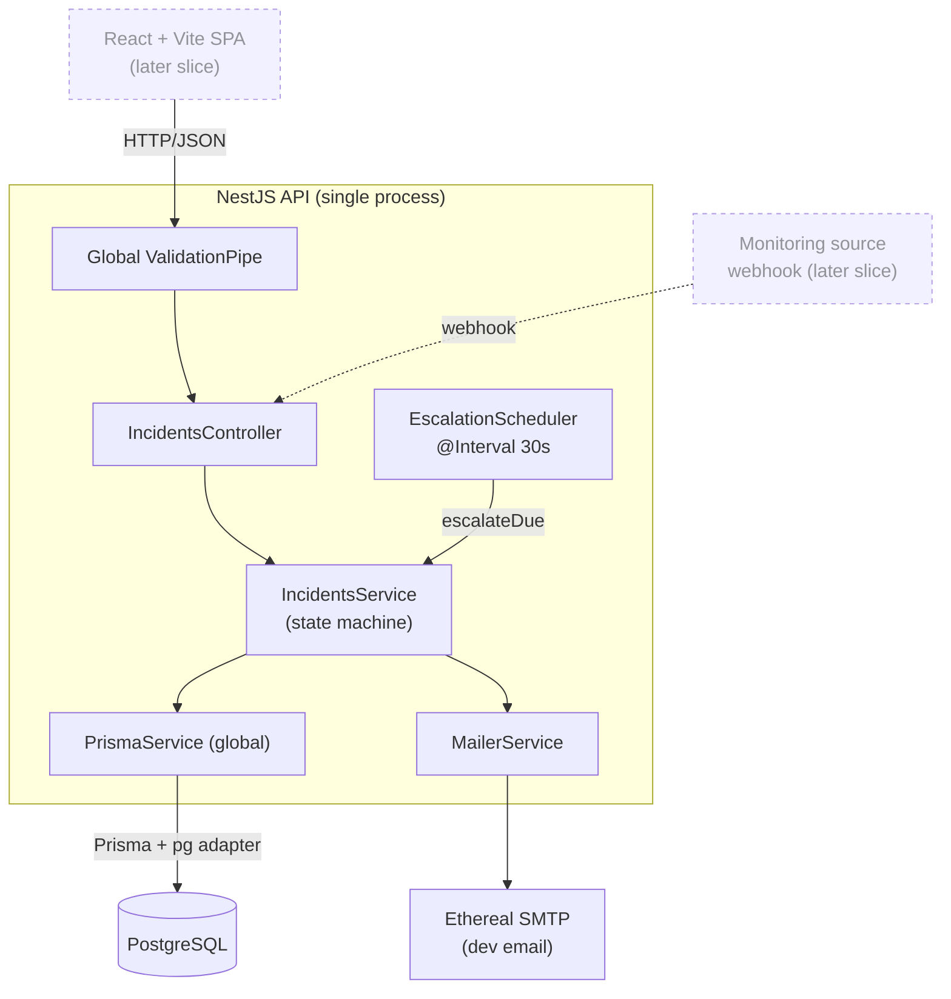
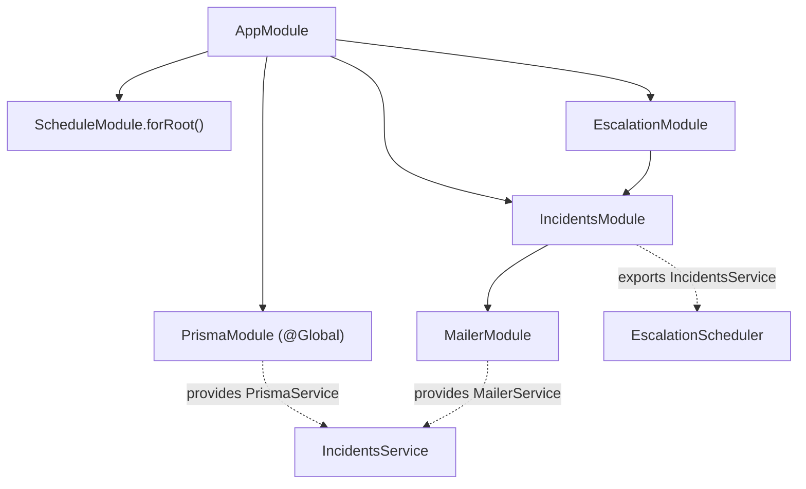
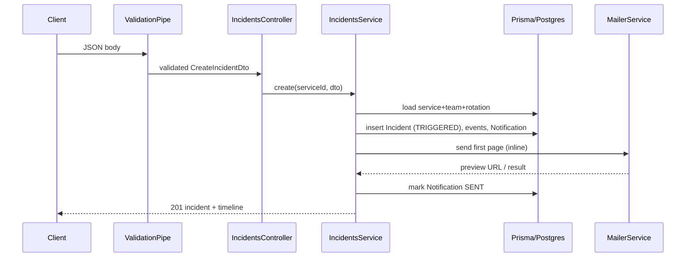

# Architecture

How the system is connected — components, the NestJS module/DI graph, the layered
request path, and deployment. Reflects Slice 1 (backend); the React client is a
later slice (shown dashed).

## Component / runtime topology

One backend process, one database — deliberately **not** distributed (no queue,
no Redis, no microservices). The scheduler runs **in-process** on a timer.

- **Requests** flow Client → ValidationPipe → Controller → Service → Prisma → DB.
- **Escalation** has no caller: the `EscalationScheduler` fires every 30s and calls
  the same `IncidentsService`, so the state machine lives in exactly one place.
- **Email** is a side effect of the service (inline on create, on escalation).

## NestJS module & DI graph

- **`PrismaModule` is `@Global`** — `PrismaService` is injectable everywhere without
  re-importing. It extends `PrismaClient` with the `@prisma/adapter-pg` driver
  adapter, connecting via `DATABASE_URL`.
- **`IncidentsModule`** imports `MailerModule` and **exports `IncidentsService`**, so
  **`EscalationModule`** (which imports `IncidentsModule`) can reuse it.
- **`ScheduleModule.forRoot()`** activates the `@Interval` in `EscalationScheduler`.

## Layers & responsibilities

| Layer | File(s) | Responsibility |
|---|---|---|
| Bootstrap | `main.ts` | load `.env`, global `ValidationPipe`, listen |
| Controller | `incidents/incidents.controller.ts` | HTTP routing, DTO binding — no logic |
| DTOs | `incidents/dto/*` | request validation (`class-validator`) |
| Service | `incidents/incidents.service.ts` | **all business logic** — the state machine, guards, notify |
| Scheduler | `escalation/escalation.scheduler.ts` | timer only; delegates to the service |
| Mailer | `mailer/mailer.service.ts` | email transport (Ethereal + fallback) |
| Data access | `prisma/prisma.service.ts` + generated client | DB access |

Cross-cutting: validation is a single global pipe (`whitelist` +
`forbidNonWhitelisted` + `transform`); errors use Nest's standard
`{ statusCode, message, error }` shape (e.g. `ConflictException` → 409,
`ForbiddenException` → 403, `NotFoundException` → 404).

## Request lifecycle — `POST /services/:id/incidents`

## Deployment (target)

- **Railway:** the NestJS API + a managed Postgres. Config via env
  (`DATABASE_URL`, `PORT`), not committed. Migrations via `prisma migrate deploy`.
- Email swaps from Ethereal to a real provider (Resend/SMTP) via env.
- No Redis/queue to provision — the escalation timer is in the API process.
  (Caveat: with multiple API replicas the in-process poller would run per replica;
  v1 targets a single instance. A leader/lock or moving to a queue is a v2 concern.)

See [escalation-flow.md](./escalation-flow.md) for the timer mechanism and
[decisions.md](./decisions.md) for why it's queue-free.
