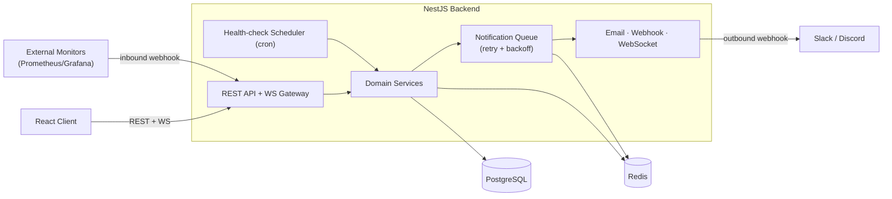

# 🏗️ Architecture

How a request travels, where each kind of logic lives, and how the system's parts connect.

---

## 1. The system in one loop

Everything serves one cycle:

```
WATCH service ──► RAISE incident ──► ROUTE to on-call user ──► NOTIFY ──► (resolve, repeat)
```

Every module is machinery bolted onto this loop. If a feature doesn't serve it, it's scope creep.

---

## 2. Runtime topology



| Component | Tech | Role |
|-----------|------|------|
| API + DI | NestJS | REST endpoints, modular structure |
| Persistence | PostgreSQL + Prisma | durable state, migrations |
| Cache / broker | Redis | queue backing store, time-series cache |
| Async jobs | BullMQ + Redis | notification delivery, retries — **the backbone** |
| Scheduler | `@nestjs/schedule` | periodic health-check polling |
| Real-time | WebSockets (Socket.IO) | live incident alerts |

> **Key insight:** the job queue powers *both* notifications *and* (eventually) scheduled work —
> one durable pipeline ties the system together.

---

## 3. Layered architecture (per module)

Each feature module is a vertical stack with **strict, one-directional dependencies**:

```
HTTP Request
   │
   ▼
┌─────────────┐  Controller   — routing only. Parse request, call service, return result.
│             │                 NO business logic, NO db access.
├─────────────┤  DTO + Pipe    — validate & shape input before it enters the app.
├─────────────┤  Service       — ALL business logic. The only layer that talks to Prisma.
├─────────────┤  PrismaService — typed DB access (the generated client).
└─────────────┘
   │
   ▼
PostgreSQL
```

**The rule:** dependencies point **downward only**. Controllers depend on services; services depend
on Prisma. Nothing points back up. A service never imports a controller; the DB never knows about HTTP.

**Why:** each layer is swappable and testable in isolation — you can unit-test a service with a mocked
Prisma, and the controller stays a thin, boring translator.

---

## 4. Request lifecycle (the pipeline)

A request passes through Nest's pipeline **in this fixed order**:

```
Request
  → Middleware      (raw req/res — logging, cors)
  → Guard           (authn/authz — "are you allowed?")   ← Phase 2+
  → Interceptor(pre)(wrap/transform — e.g. response envelope, timing)
  → Pipe            (validate + transform body → typed DTO)  ← ValidationPipe, done
  → Controller      (route handler)
  → Service         (business logic → DB)
  → Interceptor(post)(shape the response)
  → Exception Filter(only if something threw — formats the error)  ← global, consistent shape
Response
```

You rarely write all of these — you *declare* the ones a route needs, and Nest assembles the pipeline.

---

## 5. Where cross-cutting concerns live

| Concern | Mechanism | Scope |
|---------|-----------|-------|
| Input validation | `ValidationPipe` | global (`main.ts`) ✅ |
| Auth / RBAC | `Guards` + `@Roles` | global or per-route, Phase 2 |
| Consistent error shape | global **Exception Filter** | global |
| Response transform / logging | `Interceptors` | global or per-route |
| DB access | `PrismaService` via `@Global PrismaModule` | injected everywhere ✅ |
| Config / secrets | `@nestjs/config ConfigModule` | global |
| Shared guards/decorators | `common/` module | imported where needed |

**Principle:** cross-cutting logic is declared **once, centrally** — never copy-pasted into each controller.

---

## 6. Module composition

```
AppModule (root)
├── ConfigModule        (global — env)
├── PrismaModule        (global — db)   ✅
├── CommonModule        (guards, filters, interceptors)
└── feature modules ────────────────────────────────────
    UsersModule ✅next · AuthModule · TeamsModule · ServicesModule
    IncidentsModule · MonitoringModule · OnCallModule
    NotificationsModule · WebhooksModule · AnalyticsModule
```

Each feature module is **self-contained** (controller + service + DTOs) and registered once in
`AppModule`. Shared infra (`Prisma`, `Config`) is `@Global`, so features inject it without re-importing.
Build order is dependency-driven — see [dependency-graph.md](./dependency-graph.md).
