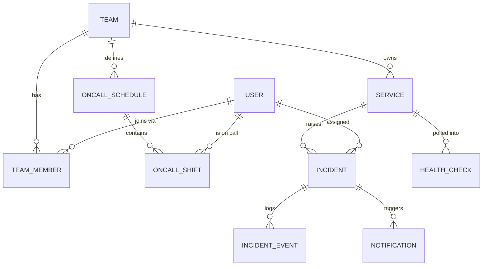

# 🗃️ Data Model

The **most expensive artifact to get wrong** — once tables hold live data, reshaping them is
painful. So we design relations and constraints up front, but **grow the schema one slice at a
time** (only `User` exists today; the rest land with their modules).

> Source of truth is `server/prisma/schema.prisma`. This doc is the *design intent* behind it.

---

## Entity-Relationship overview

`USER` is the **hub** — most things point at it. That, plus "depends on nothing," is why it's built first.

---

## Entities

Legend: 🔒 unique · 🔑 FK · ⏱ timestamped (`createdAt`/`updatedAt`) · default in `()`.

### User  — ✅ built
| Field | Type | Notes |
|-------|------|-------|
| `id` | `uuid` PK | |
| `name` | `string` | required |
| `email` | `string` 🔒 | unique, login identifier |
| `passwordHash` | `string` | bcrypt; **never** returned by API |
| `role` | `Role` enum | `(VIEWER)` |
| ⏱ `createdAt`/`updatedAt` | `DateTime` | |

`enum Role { ADMIN, ON_CALL, VIEWER }`

### Team  — Phase 1
| Field | Type | Notes |
|-------|------|-------|
| `id` | `uuid` PK | |
| `name` | `string` 🔒 | |
| ⏱ | | |

### TeamMember  *(join: User ↔ Team, many-to-many)*  — Phase 1
| Field | Type | Notes |
|-------|------|-------|
| `id` | `uuid` PK | |
| `userId` | 🔑 → User | composite-unique `(userId, teamId)` |
| `teamId` | 🔑 → Team | |
| `joinedAt` | `DateTime` | |

> Explicit join table (not implicit m-n) so membership can later carry data (role-in-team, joinedAt).

### Service  — Phase 1
| Field | Type | Notes |
|-------|------|-------|
| `id` | `uuid` PK | |
| `name` | `string` | |
| `healthEndpointUrl` | `string` | URL polled by the monitor |
| `status` | `ServiceStatus` enum | `(UNKNOWN)` |
| `teamId` | 🔑 → Team | owner |
| ⏱ | | |

`enum ServiceStatus { UP, DOWN, UNKNOWN }`

### Incident  — Phase 1 (core of the loop)
| Field | Type | Notes |
|-------|------|-------|
| `id` | `uuid` PK | |
| `title` | `string` | |
| `severity` | `Severity` enum | `P1`/`P2`/`P3` |
| `state` | `IncidentState` enum | `(TRIGGERED)` |
| `serviceId` | 🔑 → Service | |
| `assignedUserId` | 🔑 → User, nullable | current on-call |
| `acknowledgedAt` | `DateTime?` | set on ACK |
| `resolvedAt` | `DateTime?` | set on RESOLVE |
| ⏱ | | |

`enum Severity { P1, P2, P3 }`
`enum IncidentState { TRIGGERED, ACKNOWLEDGED, RESOLVED }`

### IncidentEvent  *(activity log)*  — Phase 1
| Field | Type | Notes |
|-------|------|-------|
| `id` | `uuid` PK | |
| `incidentId` | 🔑 → Incident | |
| `action` | `string` | e.g. `CREATED`, `ACKNOWLEDGED`, `ASSIGNED` |
| `actorUserId` | 🔑 → User, nullable | null = system-generated |
| `metadata` | `Json?` | freeform detail |
| `createdAt` | `DateTime` | append-only |

### OnCallSchedule  — Phase 4
| Field | Type | Notes |
|-------|------|-------|
| `id` | `uuid` PK | |
| `teamId` | 🔑 → Team | |
| `rotationType` | enum `WEEKLY`/`DAILY` | |
| `intervalDays` | `int` | |
| ⏱ | | |

### OnCallShift  — Phase 4
| Field | Type | Notes |
|-------|------|-------|
| `id` | `uuid` PK | |
| `scheduleId` | 🔑 → OnCallSchedule | |
| `userId` | 🔑 → User | |
| `startsAt` / `endsAt` | `DateTime` | |
| `isOverride` | `bool` | `(false)` — manual override |

### Notification  — Phase 5
| Field | Type | Notes |
|-------|------|-------|
| `id` | `uuid` PK | |
| `incidentId` | 🔑 → Incident | |
| `channel` | enum `EMAIL`/`WEBHOOK`/`WEBSOCKET` | |
| `status` | enum `PENDING`/`SENT`/`FAILED` | |
| `attempts` | `int` | `(0)` — retry counter |
| `lastError` | `string?` | |
| ⏱ | | |

### HealthCheck  *(time-series)*  — Phase 3
| Field | Type | Notes |
|-------|------|-------|
| `id` | `uuid` PK | |
| `serviceId` | 🔑 → Service | |
| `status` | `ServiceStatus` enum | |
| `latencyMs` | `int` | |
| `checkedAt` | `DateTime` | indexed (time-series queries) |

---

## Design rules applied here

- **Explicit join tables** (`TeamMember`) over implicit many-to-many — they can grow fields later.
- **Nullable FKs where the relation is optional** (`Incident.assignedUserId` — an incident can exist before assignment).
- **Append-only tables** (`IncidentEvent`, `HealthCheck`) — never updated, only inserted; cheap audit & history.
- **Enums in the DB**, not strings — invalid states become impossible, not just discouraged.
- **Indexes** on FK columns and time-series sort keys (`HealthCheck.checkedAt`, `Incident.state`).
- **Schema grows per slice** — adding `Team` introduces the `Team`↔`User` link *from the Team side*; `User` is never retro-reshaped.
