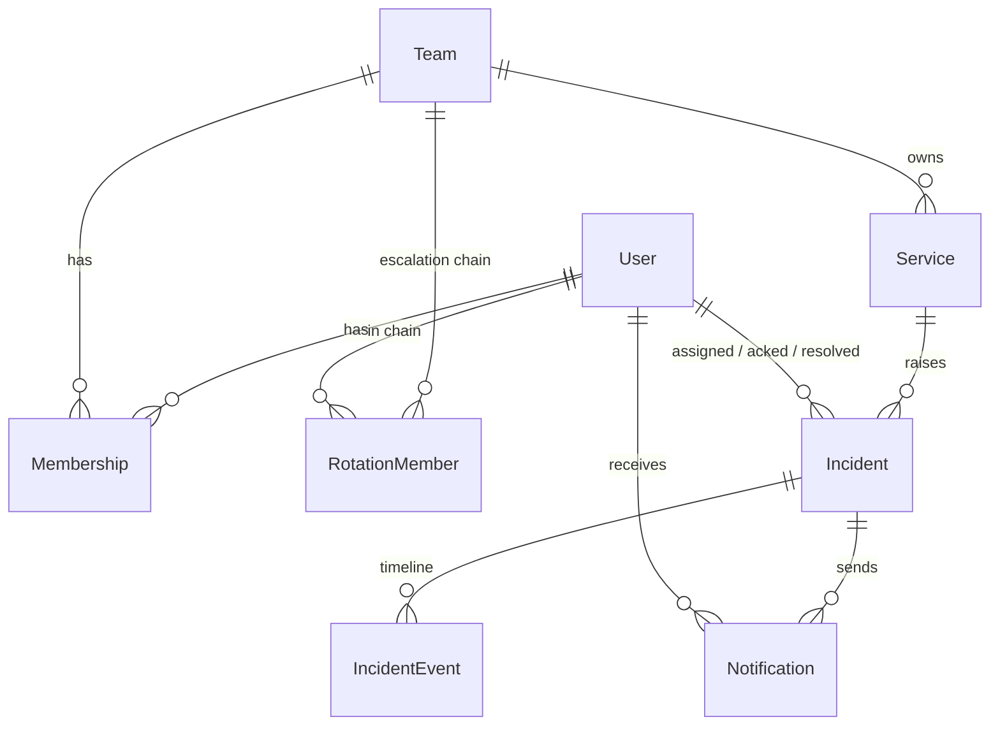

# Data Model

The persistence of the stories + state machine. Every table and column traces
to a story or a state-machine action. Source of truth: `server/prisma/schema.prisma`
(migration `20260727120328_init_v1`).

- **UUID** primary keys everywhere.
- **8 models, 7 enums.**
- Rotation is **folded into Team** (one rotation per team in v1): the timeout
  lives on `Team`, members in the `RotationMember` join table.

## Enums
- `Role` — ADMIN, RESPONDER, VIEWER
- `Severity` — P1, P2, P3
- `IncidentStatus` — TRIGGERED, ACKNOWLEDGED, RESOLVED
- `IncidentSource` — MANUAL, WEBHOOK
- `IncidentEventType` — TRIGGERED, NOTIFIED, ESCALATED, ACKNOWLEDGED, RESOLVED
- `NotificationChannel` — EMAIL
- `NotificationStatus` — PENDING, SENT, FAILED

## Models (`?` nullable · `→` FK · 🔑 unique)

| Model | Key fields | Indexes |
|---|---|---|
| **User** | email🔑, name, passwordHash, timestamps | — |
| **Team** | name, escalationTimeoutMinutes (=5), timestamps | — |
| **Membership** | userId→User, teamId→Team, role | uniq(userId,teamId), idx(teamId) |
| **Service** | name, description?, teamId→Team, integrationKey🔑, timestamps | uniq(teamId,name), idx(teamId) |
| **RotationMember** | teamId→Team, userId→User, order | uniq(teamId,userId), uniq(teamId,order) |
| **Incident** | serviceId→Service, title, description?, severity (=P3), status (=TRIGGERED), source (=MANUAL), currentOnCallIndex (=0), assignedUserId?→User, acknowledgedAt?, acknowledgedById?→User, resolvedAt?, resolvedById?→User, nextEscalationAt?, timestamps | idx(serviceId), idx(status), **idx(status,nextEscalationAt)**, idx(assignedUserId) |
| **IncidentEvent** | incidentId→Incident, type, actorUserId?→User (null=system), message?, metadata:Json?, createdAt | idx(incidentId,createdAt) |
| **Notification** | incidentId→Incident, userId→User, channel (=EMAIL), status (=PENDING), attempts (=0), lastError?, sentAt?, timestamps | idx(status), idx(incidentId) |

## Notable relations (Prisma names)
`User` carries four named relations to `Incident`/`Notification` — Prisma needs
explicit names to disambiguate:
- `assignedIncidents` ← `Incident.assignedUser` `@relation("assignee")`
- `ackedIncidents` ← `Incident.acknowledgedBy` `@relation("ackedBy")`
- `resolvedIncidents` ← `Incident.resolvedBy` `@relation("resolvedBy")`
- `notifications` ← `Notification.user` `@relation("recipient")`
- `authoredEvents` ← `IncidentEvent.actor` `@relation("eventActor")`

## Why these shapes
- **`idx(status, nextEscalationAt)`** is the escalation poller's hot path — it
  makes "find TRIGGERED incidents whose timer is due" a cheap indexed scan, which
  is what lets the design stay **queue-free** (no Redis/BullMQ).
- **First-class `Notification`** table (status + attempts) exists so notification
  retry is possible in-process — you can't retry a failure you didn't record.
- `assignedUserId` is nullable for the empty-rotation case.

See [decisions.md](./decisions.md) for full rationale on UUIDs, the folded
rotation, the notification table, and the no-delete choice.
