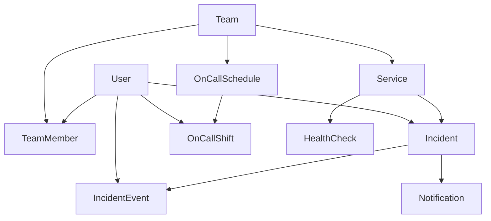

# 🔗 Dependency Graph & Build Order

The one rule that sets the order:

> **You cannot build a relationship to a thing that doesn't exist yet.**
> Build the noun before the verb that needs it.

This is just a dependency graph flattened into a build sequence.

---

## 1. Entity dependencies (what FK-points-at-what)

```
User ───────────────► (depends on nothing)        ◄── build first
Team ───────────────► (nothing)
TeamMember ─────────► User, Team
Service ────────────► Team
Incident ───────────► Service, User
IncidentEvent ──────► Incident, User
OnCallSchedule ─────► Team
OnCallShift ────────► OnCallSchedule, User
Notification ───────► Incident
HealthCheck ────────► Service
```



**Reading it:** an arrow `A --> B` means "B needs A to exist first." `User` and `Team` are roots
(no incoming arrows) — everything ultimately traces back to them.

---

## 2. Module dependencies

```
common      → (nothing)
prisma      → (nothing)            ✅
users       → prisma               ◄── building now
auth        → users
teams       → users
services    → teams
incidents   → services, users
monitoring  → services, incidents
on-call     → teams, users
notifications → incidents, queue(redis)
webhooks    → incidents
analytics   → incidents, services
```

---

## 3. Build order (topological sort → matches the roadmap)

Each step is shippable before the next begins.

| Order | Build | Unlocks | Phase |
|-------|-------|---------|-------|
| 0 | scaffold · prisma · config · common | the spine | ✅ 0 |
| 1 | **Users** | identity for everything | ◄ **now** (1) |
| 2 | Teams (+ membership) | ownership & grouping | 1 |
| 3 | Services | the things being watched | 1 |
| 4 | Incidents (+ events, state machine) | **the core loop's center** | 1 |
| 5 | Auth & RBAC | secure everything above | 2 |
| 6 | Monitoring (cron) | auto-raise incidents | 3 |
| 7 | On-call (rotations/shifts) | who to route to | 4 |
| 8 | Notifications (queue+retry) | tell them | 5 |
| 9 | Real-time (WS) | live updates | 6 |
| 10 | Inbound webhooks | external alert ingestion | 7 |
| 11 | Analytics | MTTR, uptime, heatmap | 8 |
| 12 | Frontend + Docker deploy | ship it | 9 |

> **Why Auth comes *after* core domain (5, not 1):** you can't write meaningful guards until the
> resources they protect exist. Build the things, then lock the doors. (Endpoints stay open until then.)

---

## 4. Within a single slice — the micro build order

Same principle, one level down. For any feature:

```
schema.prisma  →  migrate  →  generate
      │
      ▼
   DTO (input shape)  →  Service (logic)  →  Controller (routes)  →  Module (wire)
      │
      ▼
   register in AppModule  →  E2E test proves request→DB→response
```

Each file depends only on the one above it — so this is the order you write them in.
