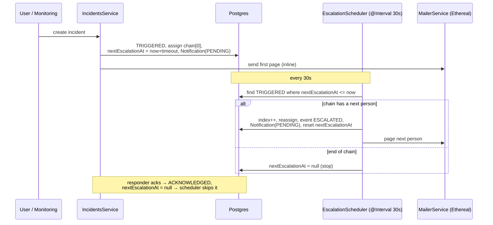

# Escalation Flow

The one genuinely tricky async piece: escalation happens on a timer with no user
present. This is where the **queue-free** decision has to prove itself — and it
does, with nothing but a timestamp column and an interval.

## Mechanism
- `Incident.nextEscalationAt` + the `idx(status, nextEscalationAt)` index.
- `EscalationScheduler` (`@nestjs/schedule`, **every 30s**) calls a plain
  `runEscalations(now)` → `IncidentsService.escalateDue(now)`.
- `escalateDue` queries `status = TRIGGERED AND nextEscalationAt <= now` and, per
  incident, advances to the next person in the chain or stops at the end.
- The **first page is sent inline** on create (most time-sensitive); the poller
  handles escalations only.
- `runEscalations(now)` takes `now` as a parameter so tests drive it with a
  controlled clock — no 30s wait. (`server/src/escalation/escalation.scheduler.spec.ts`.)

## Notifications
- Each notification is a `Notification` row (`PENDING → SENT/FAILED`), sent via
  `MailerService`: Ethereal test SMTP (real send + preview URL) with an in-memory
  stream-transport fallback when offline.
- **Retry (3× ~1 min on FAILED) is designed but deferred to a later slice** — in
  Slice 1 a failed send is recorded `FAILED` and logged.

## Verified
Live run: create → first Ethereal email → the real 30s poller escalated
Alice → Bob → ack → resolve. Escalation timing is also covered by an automated
test. See [decisions.md](./decisions.md) for the queue-free rationale.
