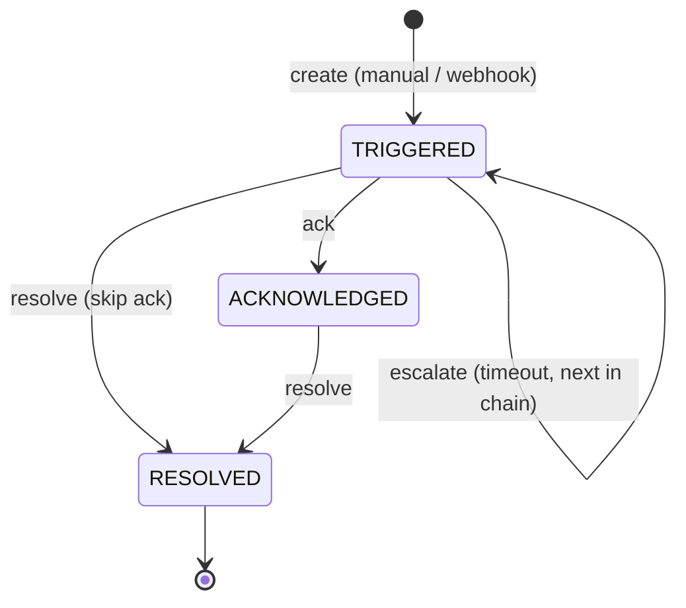

# Incident State Machine

The heart of the domain. An incident's `status` and the legal transitions between
states are the core business logic — the data model's timestamp fields and the
API's action endpoints are derived from this.

States: **TRIGGERED → ACKNOWLEDGED → RESOLVED**. `RESOLVED` is terminal (no reopen in v1).

## Transitions

| From | Event | To | Actions | Guard |
|---|---|---|---|---|
| — | create | TRIGGERED | assign chain[0] **or unassigned if no rotation** (then notify team admins); event `TRIGGERED`; `Notification(PENDING)`; send first email inline; event `NOTIFIED`; set `nextEscalationAt = now + timeout` | — |
| TRIGGERED | escalate (timer) | TRIGGERED | `currentOnCallIndex++`; reassign; event `ESCALATED`; notify new target; reset `nextEscalationAt` | chain has a next person; else **stop** (`nextEscalationAt = null`) |
| TRIGGERED | ack | ACKNOWLEDGED | **assignee = acker**; set `acknowledgedAt/By`; `nextEscalationAt = null`; event `ACKNOWLEDGED` | actor is a responder/admin on the owning team |
| TRIGGERED / ACKNOWLEDGED | resolve | RESOLVED | set `resolvedAt/By`; `nextEscalationAt = null`; event `RESOLVED` | actor is a responder/admin on the owning team |

## Guards / NEVERs (enforced in `IncidentsService`)
- Acting on a `RESOLVED` incident → **409 Conflict** (terminal).
- Acking an already-`ACKNOWLEDGED` incident → **409** (single-owner).
- A non-member or `VIEWER` acting → **403 Forbidden** (`assertResponder`).
- The scheduler never escalates an acked/resolved incident (query filters
  `status = TRIGGERED`), never past the last person, never notifies a non-target.

## Edge decisions
- **Empty rotation at create:** the incident is still created (never drop an
  alert), left unassigned, and the team's admins are notified.
- **Ack transfers ownership:** because ack is team-wide, whoever acks becomes
  the assignee.
- **No de-ack** (`ACKNOWLEDGED → TRIGGERED`) in v1.

See [decisions.md](./decisions.md) for the *why* behind each of these.
